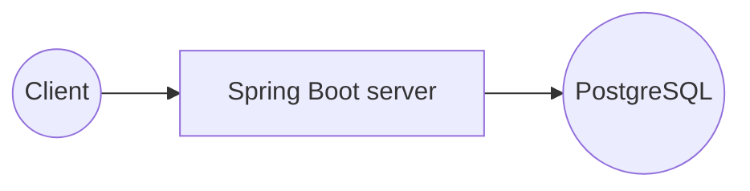
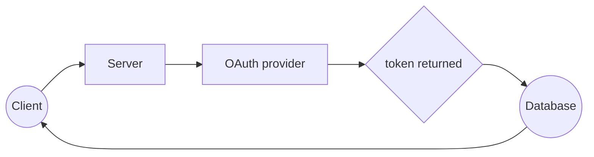
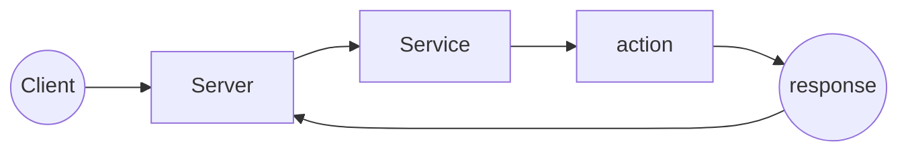

# Spring Boot stack documentation
This stack uses Java, Spring Boot, Spring Data JPA, PostgreSQL, React and React Native.

## How to use
Download Java 17+ here: [Adoptium](https://adoptium.net/) <br>
Download Docker here: [Docker website](https://www.docker.com/products/docker-desktop)

Copy `backend/.env.example` to `backend/.env` and fill in your own OAuth credentials before starting.

The whole stack (database, server, web and mobile) is started with:

```
docker compose up --build
```

To run only the backend without Docker:

```
cd backend
mvn spring-boot:run
```

## How to test

The fastest way is to run only the database and the server (no frontends needed):

```
docker compose up --build db server
```

The API listens on `http://localhost:8080`. With the server running, you can check it:

```
# services catalog
curl http://localhost:8080/about.json

# create a user
curl -X POST http://localhost:8080/users/add \
  -H "Content-Type: application/json" \
  -d '{"username":"arnaud","email":"arnaud@test.com"}'

# create an automation for that user
curl -X POST "http://localhost:8080/automations/add?userEmail=arnaud@test.com" \
  -H "Content-Type: application/json" \
  -d '{"label":"demo","description":"demo","actions":[{"service":"Gmail","name":"checkNewEmails"}],"reactions":[],"activated":true}'

# list the user automations
curl http://localhost:8080/automations/arnaud@test.com
```

Routes that call external providers (`/api/{service}/{action}`, `/auth/...`) require the
matching OAuth credentials in `backend/.env`.

To run the JUnit tests:

```
cd backend
mvn test
```

## How it works



## User connection


>[!CAUTION]
>You can't use the web and app without connecting first. Reaching a page without logging in may crash the web and app.

## Services



>[!IMPORTANT]
>You need to authenticate before using the project APIs.

The catalog of services, actions and reactions is exposed at `GET /about.json`.

### Main routes

- `GET /about.json` — services, actions and reactions catalog
- `POST /users/add` — create a user
- `GET /automations`, `GET /automations/{userEmail}` — list automations
- `POST /automations/add?userEmail=` — create an automation
- `POST /automation/update/{id}`, `DELETE /automation/{id}` — update / delete
- `GET /api/{service}/{action}` — run a service action or reaction
- `GET /auth`, `/auth/github`, `/auth/deezer` — OAuth flows

### Adding a service

A service is a Spring `@Service` bean implementing `com.area.service.AreaService`
(`getName()` + `execute(action, params)`). It is auto-registered by `ServiceRegistry`
and reachable through `GET /api/{service}/{action}`.

[Back to project readme](../README.md)
